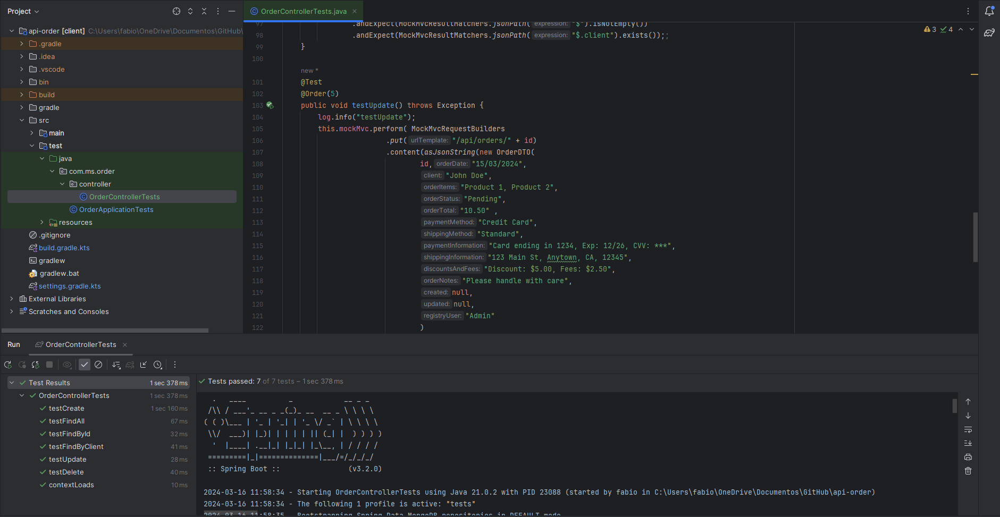
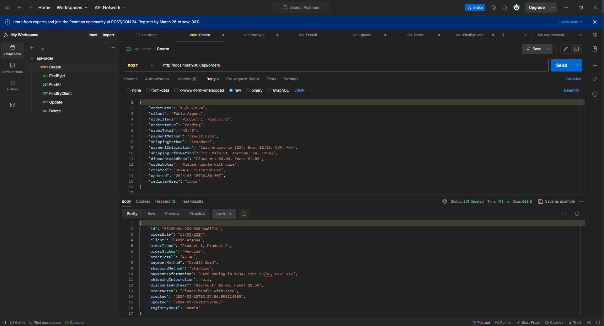

# Order Microservice API

## Introduction
Welcome to the documentation for the Order Microservice API. This microservice is designed to handle orders within a larger system. Below you will find information on how to get started, important dependencies, testing procedures, and additional resources.

## Getting Started
To begin using the Order Microservice, please refer to the following sections for detailed guidance:

- Official Gradle Documentation
- Spring Boot Gradle Plugin Reference Guide
- Creating an OCI Image
- Spring Boot DevTools
- Spring Web
- Spring Data MongoDB
- Validation

## Guides

Explore the following guides to learn how to utilize specific features effectively:

- Building a RESTful Web Service
- Serving Web Content with Spring MVC
- Building REST services with Spring
- Accessing Data with MongoDB
- Validation

For further insights and assistance, refer to these additional references:
Gradle Build Scans – insights for your project's build

## Export Postman Additional Links

Exporting Postman Collection
To access the Postman Collection for testing the API endpoints, follow these steps:

### Download the collection
file from the following link: api-order.postman_collection.json.
1. Import the downloaded file into Postman by navigating to the import option and selecting the file.
2. This will load the project's collection.

### [Postman_collection.json](api-order.postman_collection.json).

## Test-Driven Development
Este projeto foi desenvolvido seguindo a metodologia TDD (Test-Driven Development), onde os testes foram escritos antes da implementação do código, garantindo assim uma abordagem orientada a testes desde o início do desenvolvimento.

# MongoDB NoSQL Database in Docker

## The collection for production and testing environments is illustrated below:

This documentation provides comprehensive insights into utilizing the Order Microservice API efficiently. For any further inquiries or assistance, please refer to the provided resources or contact the development team.

